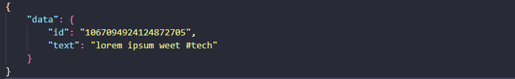
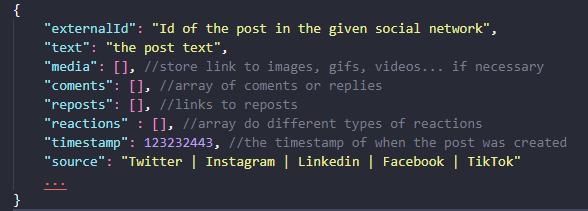

# Social Media Scraper

## Description

This API offers resources to monitor public social media posts based on filters, for example posts containing
a specific hashtag. The system streams posts in real time and triggers alerts when an anomaly is found. Initially, the API is only focused in X (twitter) posts, but it can be extended to monitor other social networks as well.

## Features

### Stream

The twitter posts stream mechanism is based on this [sample](https://github.com/xdevplatform/Twitter-API-v2-sample-code/blob/main/Filtered-Stream/filtered_stream.js) from twitter dev team. Currently this project doesn't interact with the actual twitter API as the streaming endpoints are not available in the free plan, but it's possible to see the streaming mechanism working by mocking the twitter API:

If you set the `TWITTER_MODE=mock` env variable, the `ScraperModule` will start a job that keeps pulling data from the `/stream` endpoint, which is also mocked in this API (modules/twitter-mock) and and get the "tweets" from a dumb `tweets.json` file in the root of the project. For that, you also will have to set the following variables so that streaming can use the fake endpoints do get the tweets.

```
TWITTER_API_TOKEN=twitter-mock-token
TWITTER_API_URL=http://localhost:3000
```

The streaming mechanism is based on twitter api docs, and so is the twitter mock. The idea is to allow the developer to
switch between the mock and the actual api just by changing the env variables above. Therefore, the json file with tweets
must follow the same contract defined in the twitter `/stream` [endpoint](https://developer.x.com/en/docs/twitter-api/tweets/filtered-stream/api-reference/get-tweets-search-stream).



The file should always have one only tweet, but once you start the application you can change the data of the file and it will be automatically streamed.

Once a tweet is streamed, the api will store it temporarily in a Redis instance and there will be a job running that will often get data from cache and store it permanently in the database. The db only stores up to 100.000 tweets (this number is configurable in the `MAX_STORED_POSTS` env variable), so there is another job that clean up the oldest ones once this limit is reached.

Last, but not least, the `ScraperModule` also handles the filtering set of the posts you wish to filter, so don't forget to specify the relevant hashtags in the `MONITORED_HASHTAGS='#test,#tech'` env variable. In the twitter mock mode, no endpoint will be actually called for this, instead the fake `/stream` endpoint will handle the filtering for you.

Tech Stack: [Node.js](https://nodejs.org/en/docs/), [Typescript](https://www.typescriptlang.org/docs/), [Nest.js](https://docs.nestjs.com/), [PostgreSQL](https://www.postgresql.org/docs/)

### Anomaly detection

The anomaly detection system is based on an average of relevant posts per minute and on a variation percent. If the system identify a variation higher than the percent defined, it will consider it as an anomaly. These values can also be set using env variables:

```
AVERAGE_POSTS_PER_MINUTE=1000
ANOMALY_VARIATION_PERCENT=50
```

In the example above, we're defining that the average of relevant posts is 1000 per minute and the acceptable variation is 50%. This means that if at a random time window of one minute the system identifies 1501 posts, that will be treated as an anomaly.

The `NotificationService` is responsible for notifying anomalies, but at this point it is only logging that the anomaly was detected. In the feature this class can be extended so it becomes a wrapper for various notifications systems (email, slack, any kind of alerts).

Some of the business advantages of having such a system is: monitor end user behavior and use it to build personas, antecipate user needs/wishes and fast reaction to moments of brand crisis.

## Requirements

- Node v20
- Docker and docker compose

## Tech Stack

- Node.js, Typescript, Nest.js, Redis, MongoDB
- This application is based on a [Nest.js boilerplate](https://github.com/hpsmatheus/nestjs-boilerplate) built by me and it leverages some resources such as error handling, logging, requests monitoring, request validation pipes and it also contains unit tests for this resources. There is also an `app.mock.builder` ready to serve as testing instance of the api for writing e2e tests.

## Run Application Locally in Debug Mode

First, create an `.env` (copy of `.env.example`) file in the root of the project, then run the following:

```bash
$ npm install
$ docker compose up mongo
$ docker compose up redis
$ npm run start:dev
```

## API Docs

http://localhost:3000/api-docs

## Tests

```bash
# unit tests
$ npm run test

# test coverage
$ npm run test:cov
```

## Linter and formatting

```bash
# find problems
$ npm run lint

# find and fix problems automatically
$ npm run lint:fix

# format code
$ npm run format
```

## Folder Structure

```
> src
  > core                            (files that are used all over the API)
     > error                        (files to do the error handling and format API errors)
     > request-interceptor          (Nest.js interceptor to catch errors and do API logging)
     > api-validation.pipe.ts       (Nest.js pipe to validate DTOs)
     > swagger-response.ts          (abstraction to add and reuse swagger responses)

  > modules                         (limited modules of the application divided by their own domain)


  > typings                         (contains all the API typings)

  > test
    > mocks            (mocks used all over the tests using builder pattern)
    > unit             (unit tests)


```

## Future improvements and possible project evolutions

- The post schema structure in db is not focused only in twitter posts, it's actually agnostic and can be extended to store data from other social networks also. Example:
  

- Develop a more robust mechanism to set filters of relevant posts. One possibility is to have and admin app in which business staff can set this filters and this api can consume it and use this filters to stream posts, converting the right filters for each different social network.
- Implement a reconnect mechanism in case the stream disconnects.
- The usage of Redis in this MVP will probably help to avoid bottlenecks in the database as it allows to set a specific pace of writing in the DB no matter how big is the traffic outside the application. But that also have some limitations. In future iterations we should probably approach strategies to avoid the API interface (at http level) and Redis to be overwhelmed.
- Using a robust message queueing system can also make the api more fault tolerant and performative, using more workers to process the incoming data and retry mechanism to avoid data loss as the communication is asynchronous.
- For now, archiving old posts it's actually deleting them but they could be moved to another data source depending on business requirements. In that way we would have a more performative database to perform heavy daily tasks and use this other data source only when consulting the history is needed (or for building dashboards in data systems, for example)

## Tech debts

- Make sure to hide sensitive information on logs
- Make the post processing mechanism generic so it can deal with posts of other social media in an agnostic approach.
- Create mechanism that checks if all required env variables are filled in the application start up

## Time Tracking

- Explore Twitter docs: ~ 2 hours
- Application setup: ~ 4 hours
- Streaming mechanism: ~ 7 hours
- Anomaly detection system: ~ 2 hours
- Unit tests: ~ 0.5 hours
- Write documentation: ~ 2 hours
